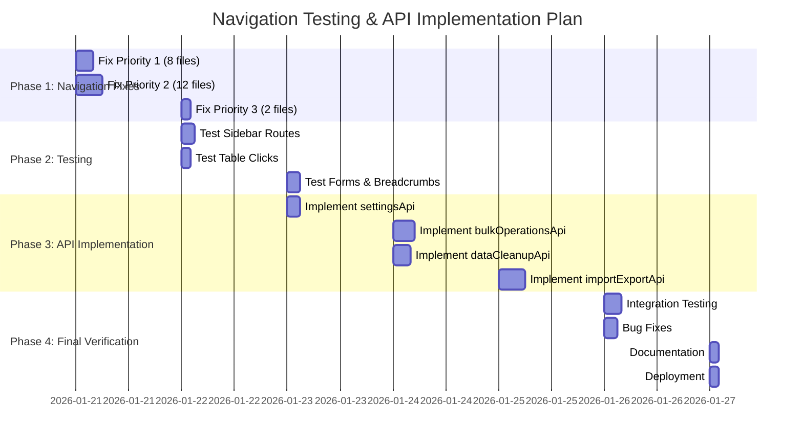

# 🎯 MASTER ACTION PLAN - Navigation & API Implementation

## 📊 Executive Summary

**Migration Status:** ✅ 100% Complete  
**Navigation Issues:** ⏳ 18/29 files remaining (62%)  
**API Implementation:** ⏳ 0/4 APIs (0%)

**Estimated Total Time:** 16-20 hours  
**Recommended Timeline:** 7 days

---

## 🗺️ Roadmap Overview



---

## 📅 Day-by-Day Action Plan

### 🔴 Day 1 (Today - 2026-01-21): Navigation Fixes Priority 1 & 2

**Duration:** 8-10 hours  
**Goal:** Fix 20/22 navigation import issues

#### Morning (4 hours)
- [ ] **09:00 - 09:30** Read documentation
  - [ ] QUICK_START_NAVIGATION_FIX.md
  - [ ] NAVIGATION_FIX_CHECKLIST.md
  
- [ ] **09:30 - 11:00** Fix Priority 1 (8 files)
  - [ ] `/platform/roles/create/page.tsx`
  - [ ] `/platform/roles/edit/[id]/page.tsx`
  - [ ] `/platform/users/create/page.tsx`
  - [ ] `/platform/users/edit/[id]/page.tsx`
  - [ ] `/platform/tenant-rate-limits/page.tsx`
  - [ ] `/platform/tenant-rate-limits/create/page.tsx`
  - [ ] `/platform/tenant-rate-limits/edit/[id]/page.tsx`
  - [ ] `/platform/legal-documents/page.tsx`
  
- [ ] **11:00 - 11:30** Test Priority 1 files
  - [ ] Manual testing in browser
  - [ ] Verify no redirects to dashboard
  - [ ] Check console for errors
  
- [ ] **11:30 - 12:00** Commit & document progress

#### Afternoon (4-6 hours)
- [ ] **13:00 - 15:00** Fix Priority 2 (12 files)
  - User Consents (3 files)
  - User Sessions (3 files)
  - User Roles (3 files)
  - User Devices (3 files)
  
- [ ] **15:00 - 16:00** Test Priority 2 files
  
- [ ] **16:00 - 17:00** Fix Priority 3 (2 files)
  - [ ] `/platform/legal-documents/[id]/page.tsx`
  - [ ] `/subscriptions/invoices/[id]/page.tsx`
  
- [ ] **17:00 - 17:30** Final verification
  ```bash
  grep -r "from ['\"]next/navigation['\"]" app/\(admin\)/platform/**/*.tsx
  # Should return: 0 results
  ```
  
- [ ] **17:30 - 18:00** Update documentation
  - [ ] NAVIGATION_FIX_STATUS.md → 100%
  - [ ] NAVIGATION_FIX_CHECKLIST.md → Mark all done
  - [ ] Commit all changes

**Deliverables:**
- ✅ All 22 navigation import issues fixed
- ✅ All files verified and tested
- ✅ Documentation updated
- ✅ Git commits pushed

---

### 🟡 Day 2 (2026-01-22): Route Testing

**Duration:** 6-8 hours  
**Goal:** Test all 30 sidebar routes + 10 table components

#### Morning (4 hours)
- [ ] **09:00 - 12:00** Test Sidebar Navigation (30 routes)
  - Admin Routes (11 routes)
  - Platform Routes (14 routes)
  - Commerce Routes (4 routes)
  - Tools Routes (3 routes)
  
  **Testing Checklist per route:**
  - [ ] Click from sidebar → Loads correctly
  - [ ] URL matches expected
  - [ ] No redirect to dashboard
  - [ ] No console errors
  - [ ] Page elements render
  - [ ] Data loads (if applicable)
  
  **Document Issues:**
  ```markdown
  ## Issues Found
  - Route: [path]
    - Issue: [description]
    - Expected: [expected behavior]
    - Actual: [actual behavior]
  ```

#### Afternoon (3-4 hours)
- [ ] **13:00 - 15:00** Test Table Row Clicks (10 tables)
  - RolesList
  - UsersTable
  - TenantsTable
  - ApplicationsTable
  - ProductsTable
  - InvoiceTable
  - WebhookTable
  - AuditLogTable
  - TrafficLogsTable
  - SystemJobsTable
  
  **Testing Pattern:**
  - [ ] Click row → Navigate to detail
  - [ ] Click Edit button → stopPropagation → Action
  - [ ] Click Delete button → stopPropagation → Confirm
  
- [ ] **15:00 - 16:30** Fix any issues found
- [ ] **16:30 - 17:00** Document and commit

**Deliverables:**
- ✅ 30 sidebar routes tested
- ✅ 10 table components verified
- ✅ Issues documented and fixed
- ✅ Testing report generated

---

### 🟢 Day 3 (2026-01-23): Forms & Start API Implementation

**Duration:** 6-7 hours  
**Goal:** Test form navigation + Implement settingsApi

#### Morning (3 hours)
- [ ] **09:00 - 10:30** Test Form Navigation (10 forms)
  - Test pattern: Fill → Save → Redirect to list
  - Document any navigation issues
  
- [ ] **10:30 - 11:30** Test Breadcrumb Navigation (5 patterns)
  - List → Detail → Edit
  - Nested routes
  - Create routes
  
- [ ] **11:30 - 12:00** Fix issues & commit

#### Afternoon (3-4 hours)
- [ ] **13:00 - 16:00** Implement settingsApi
  - [ ] Create `/api/settingsApi.ts`
  - [ ] Implement 6 methods
  - [ ] Add types and validation
  - [ ] Update `/settings/general/page.tsx`
  - [ ] Update `/settings/security/page.tsx`
  - [ ] Test all methods
  - [ ] Remove mock implementations
  
- [ ] **16:00 - 17:00** Test and verify settingsApi

**Deliverables:**
- ✅ All forms tested
- ✅ All breadcrumbs tested
- ✅ settingsApi fully implemented
- ✅ Settings pages using real API

---

### 🟡 Day 4 (2026-01-24): Bulk Operations & Data Cleanup APIs

**Duration:** 8-9 hours  
**Goal:** Implement 2 APIs

#### Morning (5 hours)
- [ ] **09:00 - 14:00** Implement bulkOperationsApi
  - [ ] Create `/api/bulkOperationsApi.ts`
  - [ ] Implement 4 methods
  - [ ] Add types and validation
  - [ ] Update `/tools/bulk-operations/page.tsx`
  - [ ] Test all methods
  - [ ] Remove mock

#### Afternoon (4 hours)
- [ ] **14:00 - 18:00** Implement dataCleanupApi
  - [ ] Create `/api/dataCleanupApi.ts`
  - [ ] Implement 6 methods
  - [ ] Add types and validation
  - [ ] Update `/tools/data-cleanup/page.tsx`
  - [ ] Test all methods
  - [ ] Remove mock

**Deliverables:**
- ✅ bulkOperationsApi implemented
- ✅ dataCleanupApi implemented
- ✅ Both tools pages working

---

### 🟢 Day 5 (2026-01-25): Import/Export API

**Duration:** 6-7 hours  
**Goal:** Implement importExportApi

#### Full Day
- [ ] **09:00 - 12:00** Implement import functionality
  - [ ] importData method
  - [ ] validateImport method
  - [ ] File upload handling
  
- [ ] **13:00 - 16:00** Implement export functionality
  - [ ] exportData method
  - [ ] exportAndDownload method
  - [ ] getTemplate method
  - [ ] downloadTemplate method
  
- [ ] **16:00 - 17:00** Update `/tools/import-export/page.tsx`
  - [ ] Replace mock
  - [ ] Test import flow
  - [ ] Test export flow
  - [ ] Test templates

**Deliverables:**
- ✅ importExportApi fully implemented
- ✅ Import/Export page working
- ✅ All 4 APIs complete

---

### 🔵 Day 6 (2026-01-26): Integration Testing & Bug Fixes

**Duration:** 6-7 hours  
**Goal:** Comprehensive testing and bug fixes

#### Morning (4 hours)
- [ ] **09:00 - 13:00** Integration Testing
  - [ ] Test complete user flows
    - Login → Navigate → Create → Edit → Delete
    - Table sorting/filtering → Detail → Back
    - Bulk operations → Cleanup → Import/Export
  - [ ] Test error scenarios
  - [ ] Test edge cases
  - [ ] Performance testing
  - [ ] Cross-browser testing

#### Afternoon (3 hours)
- [ ] **13:00 - 16:00** Bug Fixes
  - [ ] Fix any issues found in testing
  - [ ] Optimize performance issues
  - [ ] Add error boundaries if needed
  - [ ] Improve loading states

**Deliverables:**
- ✅ All user flows tested
- ✅ All bugs fixed
- ✅ Performance optimized

---

### 🟣 Day 7 (2026-01-27): Documentation & Deployment

**Duration:** 4-5 hours  
**Goal:** Finalize documentation and deploy

#### Morning (2 hours)
- [ ] **09:00 - 11:00** Documentation
  - [ ] Update all README files
  - [ ] Create API documentation
  - [ ] Update CHANGELOG
  - [ ] Create deployment guide
  - [ ] Update team handoff docs

#### Afternoon (2-3 hours)
- [ ] **11:00 - 13:00** Pre-deployment
  - [ ] Final code review
  - [ ] Run all tests
  - [ ] Build production bundle
  - [ ] Verify bundle size
  
- [ ] **13:00 - 14:00** Deploy to Staging
  - [ ] Deploy code
  - [ ] Run smoke tests
  - [ ] Verify all features
  
- [ ] **14:00 - 15:00** Production Deployment
  - [ ] Deploy to production
  - [ ] Monitor errors
  - [ ] Verify critical paths

**Deliverables:**
- ✅ All documentation complete
- ✅ Deployed to staging
- ✅ Deployed to production
- ✅ Monitoring in place

---

## 🎯 Success Criteria

### Navigation (Must Have - P0)
- [x] Migration 100% complete
- [ ] 29/29 navigation imports fixed (100%)
- [ ] 30/30 sidebar routes working
- [ ] 10/10 table clicks working
- [ ] 10/10 form navigations working
- [ ] 5/5 breadcrumb patterns working
- [ ] Zero redirect-to-dashboard issues
- [ ] Zero console navigation errors

### APIs (Should Have - P1)
- [ ] settingsApi implemented (6/6 methods)
- [ ] bulkOperationsApi implemented (4/4 methods)
- [ ] dataCleanupApi implemented (6/6 methods)
- [ ] importExportApi implemented (6/6 methods)
- [ ] All pages using real APIs (no mocks)
- [ ] Error handling implemented
- [ ] Validation implemented

### Quality (Should Have - P1)
- [ ] TypeScript no errors
- [ ] ESLint passes
- [ ] All tests passing
- [ ] Bundle size acceptable
- [ ] Performance acceptable
- [ ] Cross-browser tested

### Documentation (Nice to Have - P2)
- [ ] All docs updated
- [ ] API docs complete
- [ ] Testing guide complete
- [ ] Deployment guide complete
- [ ] Team handoff complete

---

## 📚 Quick Reference Links

### Documentation
- [NAVIGATION_TESTING_PLAN.md](./NAVIGATION_TESTING_PLAN.md) - Comprehensive testing plan
- [NAVIGATION_FIX_CHECKLIST.md](./NAVIGATION_FIX_CHECKLIST.md) - Detailed checklist
- [QUICK_START_NAVIGATION_FIX.md](./QUICK_START_NAVIGATION_FIX.md) - Quick start guide
- [API_IMPLEMENTATION_GUIDE.md](./API_IMPLEMENTATION_GUIDE.md) - API implementation guide
- [NAVIGATION_FIX_STATUS.md](./NAVIGATION_FIX_STATUS.md) - Current status (38%)
- [MIGRATION_COMPLETE_2026_01_21.md](./MIGRATION_COMPLETE_2026_01_21.md) - Migration summary

### Testing Tools
- `/scripts/test-navigation.ts` - Automated navigation testing
- Browser console commands for manual testing

### Code References
- `/components/shim/next-navigation.tsx` - Navigation shim
- `/components/shim/config.ts` - Shim configuration
- `/api/adapters/` - API client adapters

---

## 🚨 Risk Mitigation

### High Risk Items
1. **Navigation issues blocking users**
   - Mitigation: Fix Priority 1 files first
   - Rollback plan: Keep old code in git history
   
2. **API integration breaking existing features**
   - Mitigation: Test thoroughly before removing mocks
   - Rollback plan: Keep mock implementations temporarily
   
3. **Performance degradation**
   - Mitigation: Monitor bundle size and load times
   - Rollback plan: Lazy load heavy components

### Medium Risk Items
1. **TypeScript errors**
   - Mitigation: Run type-check frequently
   - Fix: Add proper types to all APIs
   
2. **Cross-browser compatibility**
   - Mitigation: Test on Chrome, Firefox, Safari
   - Fix: Add polyfills if needed

---

## 📞 Support & Help

### If Stuck on Navigation Fixes
1. Check QUICK_START_NAVIGATION_FIX.md
2. Verify shim configuration in `/components/shim/config.ts`
3. Enable debug logging: `DEBUG_SHIM = true`
4. Test with: `grep -r "next/navigation" app/`

### If Stuck on API Implementation
1. Check API_IMPLEMENTATION_GUIDE.md
2. Review existing API files in `/api/`
3. Check adapter implementation in `/api/adapters/`
4. Test with browser console

### Debug Commands
```bash
# Find remaining issues
grep -r "from ['\"]next/navigation['\"]" app/\(admin\)/**/*.tsx

# Check TypeScript
npm run type-check

# Run linter
npm run lint

# Check bundle size
npm run build -- --analyze
```

---

## ✅ Daily Checklist Template

```markdown
## Day [X] - [Date]

### Morning
- [ ] Review plan
- [ ] [Task 1]
- [ ] [Task 2]
- [ ] Test changes
- [ ] Commit (WIP)

### Afternoon
- [ ] [Task 3]
- [ ] [Task 4]
- [ ] Final testing
- [ ] Update docs
- [ ] Final commit

### End of Day
- [ ] All tasks complete
- [ ] All tests passing
- [ ] Code committed
- [ ] Docs updated
- [ ] Tomorrow's plan reviewed
```

---

## 🎉 Completion

When all tasks are done:

1. ✅ Update all progress tracking docs
2. ✅ Create final summary report
3. ✅ Archive this plan
4. ✅ Celebrate! 🎉

---

**Created:** 2026-01-21  
**Status:** 📋 ACTIVE  
**Next Update:** End of Day 1  
**Owner:** Development Team
