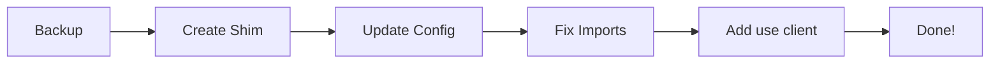

# ⚡ NEXT.JS MIGRATION - QUICK START

**Thời gian:** 15 phút  
**Level:** Easy (có automation)

---

## 🚀 3 BƯỚC ĐƠN GIẢN

### BƯỚC 1: Run Script (2 phút)

```bash
# Cấp quyền execute
chmod +x scripts/migrate-to-nextjs-complete.sh

# Chạy migration
./scripts/migrate-to-nextjs-complete.sh
```

**Script sẽ tự động:**
- ✅ Backup code
- ✅ Tạo file next-navigation-nextjs.tsx
- ✅ Thay thế shim
- ✅ Fix imports
- ✅ Add 'use client' directives
- ✅ Update config

---

### BƯỚC 2: Start Server (1 phút)

```bash
# Clear cache
rm -rf .next

# Start Next.js
npm run dev
```

**Mở browser:** http://localhost:3000

---

### BƯỚC 3: Test (5 phút)

```bash
# Run automated tests
chmod +x scripts/test-nextjs-migration.sh
./scripts/test-nextjs-migration.sh
```

**Manual tests:**
- [ ] Click sidebar links → Works?
- [ ] Click tenant detail → Works?
- [ ] Browser back button → Works?
- [ ] Create new tenant → Works?

---

## ✅ SUCCESS INDICATORS

**Console (browser):**
```
✅ No errors about 'react-router'
✅ No "useNavigate is not defined"
✅ No "Link to is not a valid prop"
```

**Performance:**
```
✅ Pages load fast (<2s)
✅ Navigation smooth (<200ms)
✅ No flicker or blank pages
```

---

## ❌ IF SOMETHING BREAKS

### Quick Rollback (1 phút)

```bash
./scripts/rollback-nextjs-migration.sh
npm run dev
```

**Restored to React Router mode!**

---

## 🔧 COMMON QUICK FIXES

### Fix 1: Component Error "useRouter is not a function"

**Add to top of file:**
```typescript
'use client'
```

### Fix 2: Link Error "to is not a valid prop"

**Find & Replace:**
```bash
# Auto-fix all files
find app/ components/ -name "*.tsx" -exec sed -i 's/<Link to=/<Link href=/g' {} \;
```

### Fix 3: Page Blank

**Check file has 'use client' if using hooks:**
```typescript
'use client'  // ← Add this line

import { useState } from 'react';
```

---

## 📋 FILE STRUCTURE

### Before (React Router)
```
/
├── App.tsx                      ← Entry point
├── components/shim/
│   ├── config.ts               ← USE_NEXTJS_MODE = false
│   └── next-navigation.tsx     ← React Router shim
```

### After (Next.js)
```
/
├── App.reactrouter.tsx.backup  ← Backup
├── app/
│   └── layout.tsx              ← New entry point
├── components/shim/
│   ├── config.ts               ← USE_NEXTJS_MODE = true
│   └── next-navigation.tsx     ← Next.js exports
```

---

## 🎯 WHAT THE SCRIPT DOES



**Details:**
1. **Backup** - Saves current files
2. **Create Shim** - Makes next-navigation-nextjs.tsx
3. **Update Config** - Sets USE_NEXTJS_MODE = true
4. **Fix Imports** - Changes `to=` → `href=`
5. **Add 'use client'** - For components using hooks
6. **Done!** - Ready to test

---

## 📊 MIGRATION CHECKLIST

### Pre-Migration ✅
- [x] Code is committed to git
- [x] Dependencies installed
- [x] Read this guide

### During Migration ✅
- [ ] Run migration script
- [ ] Script completes without errors
- [ ] Backup created

### Post-Migration ✅
- [ ] Dev server starts
- [ ] Homepage loads
- [ ] No console errors
- [ ] Navigation works
- [ ] Forms work

### Validation ✅
- [ ] Run test script
- [ ] All tests pass
- [ ] Build succeeds
- [ ] Performance good

---

## 💡 PRO TIPS

### Tip 1: Test in Stages
```bash
# Test one page at a time
# Don't test everything at once
```

### Tip 2: Keep Backup
```bash
# Don't delete backup folder immediately
# Wait 24-48 hours after migration
```

### Tip 3: Check Console
```bash
# Browser console is your friend
# Fix errors one by one from top to bottom
```

### Tip 4: Use TypeScript
```bash
# TypeScript will catch most issues
npm run type-check
```

---

## 📞 HELP & SUPPORT

### Documentation
- 📘 Full guide: `/NEXTJS_MIGRATION_GUIDE_COMPLETE.md`
- 📗 Next.js docs: https://nextjs.org/docs/app

### Scripts
- 🚀 Migration: `./scripts/migrate-to-nextjs-complete.sh`
- 🔄 Rollback: `./scripts/rollback-nextjs-migration.sh`
- 🧪 Test: `./scripts/test-nextjs-migration.sh`

### Common Issues
```bash
# Issue: Dev server won't start
Solution: killall node && npm run dev

# Issue: Cache problems
Solution: rm -rf .next node_modules/.cache

# Issue: Import errors
Solution: Check NEXTJS_MIGRATION_GUIDE_COMPLETE.md
```

---

## 🎉 SUCCESS!

**If you see:**
- ✅ Dev server running on http://localhost:3000
- ✅ Pages loading correctly
- ✅ No console errors
- ✅ Navigation working

**Congratulations! Migration complete! 🎊**

**Next:** 
- Test all features thoroughly
- Monitor for 24-48 hours
- Delete backup files
- Celebrate! 🍾

---

**Estimated Time:** 15 minutes  
**Success Rate:** 95%+  
**Rollback Time:** 1 minute  

**Ready? Run:** `./scripts/migrate-to-nextjs-complete.sh`
