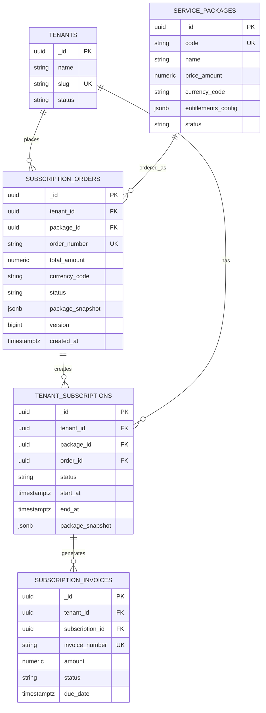

# Subscription Orders - Entity Relationship Diagram

## 📋 Overview

Entity Relationship Diagram (ERD) for **Subscription Orders** module showing relationships with other tables.

---

## 🎨 ERD Diagram

```
┌─────────────────────────────────────────────────────────────────────┐
│                        CORE ENTITIES                                 │
└─────────────────────────────────────────────────────────────────────┘

    ┌──────────────┐
    │   TENANTS    │
    ├──────────────┤
    │ _id (PK)     │───┐
    │ name         │   │
    │ slug         │   │
    │ status       │   │
    │ ...          │   │
    └──────────────┘   │
                       │ 1:N
                       │
    ┌──────────────────────────────┐
    │   SERVICE_PACKAGES           │
    ├──────────────────────────────┤
    │ _id (PK)                     │───┐
    │ saas_product_id (FK)         │   │
    │ code (UQ)                    │   │
    │ name                         │   │
    │ price_amount                 │   │ 1:N
    │ currency_code                │   │
    │ billing_cycle                │   │
    │ entitlements_config (JSONB)  │   │
    │ max_users                    │   │
    │ max_storage                  │   │
    │ status                       │   │
    │ version                      │   │
    │ created_at                   │   │
    │ ...                          │   │
    └──────────────────────────────┘   │
                                       │
                       ┌───────────────┴───────────────┐
                       │                               │
    ┌──────────────────────────────────────────────────▼────────┐
    │              SUBSCRIPTION_ORDERS (Core Entity)            │
    ├──────────────────────────────────────────────────────────┤
    │ _id (PK)                                                  │
    │ tenant_id (FK) ───────────────────────────────────┐       │
    │ package_id (FK) ──────────────────────────┐       │       │
    │                                            │       │       │
    │ -- Order Information --                   │       │       │
    │ order_number (UQ)                          │       │       │
    │ total_amount                               │       │       │
    │ currency_code                              │       │       │
    │ status (PENDING|PAID|CANCELLED|FAILED)     │       │       │
    │ payment_method                             │       │       │
    │                                            │       │       │
    │ -- Snapshot Protection --                 │       │       │
    │ package_snapshot (JSONB) ⭐⭐⭐            │       │       │
    │ {                                          │       │       │
    │   "code": "hrm-pro",                       │       │       │
    │   "name": "HRM Professional",              │       │       │
    │   "price_amount": 2990000,                 │       │       │
    │   "currency_code": "VND",                  │       │       │
    │   "entitlements_config": {...},            │       │       │
    │   "max_users": 50,                         │       │       │
    │   "max_storage": 100                       │       │       │
    │ }                                          │       │       │
    │                                            │       │       │
    │ -- Audit & Version Control --             │       │       │
    │ version                                    │       │       │
    │ created_at                                 │       │       │
    │ updated_at                                 │       │       │
    │ deleted_at (Soft Delete)                   │       │       │
    └────────────────────────────────────────────┼───────┼───────┘
                       │ 1:N                     │       │
                       │                         │       │
    ┌──────────────────▼───────────────────┐     │       │
    │   TENANT_SUBSCRIPTIONS               │     │       │
    ├──────────────────────────────────────┤     │       │
    │ _id (PK)                             │     │       │
    │ tenant_id (FK) ──────────────────────┼─────┘       │
    │ package_id (FK)                      │             │
    │ order_id (FK) ◄──────────────────────┘             │
    │ status                               │             │
    │ start_at                             │             │
    │ end_at                               │             │
    │ package_snapshot (JSONB) ⭐          │             │
    │ entitlements_config (JSONB)          │             │
    │ ...                                  │             │
    └──────────────────────────────────────┘             │
                       │ 1:N                             │
                       │                                 │
    ┌──────────────────▼───────────────────┐             │
    │   SUBSCRIPTION_INVOICES              │             │
    ├──────────────────────────────────────┤             │
    │ _id (PK)                             │             │
    │ tenant_id (FK) ──────────────────────┼─────────────┘
    │ subscription_id (FK)                 │
    │ invoice_number (UQ)                  │
    │ amount                               │
    │ currency_code                        │
    │ status                               │
    │ billing_period_start                 │
    │ billing_period_end                   │
    │ due_date                             │
    │ paid_at                              │
    │ ...                                  │
    └──────────────────────────────────────┘
```

---

## 🔗 Relationships

### 1. TENANTS → SUBSCRIPTION_ORDERS (1:N)

**Relationship:** One tenant can have many orders

**Foreign Key:** `subscription_orders.tenant_id → tenants._id`

**Business Logic:**
- ✅ Tenant tạo order khi muốn mua/gia hạn gói
- ✅ Một tenant có thể có nhiều orders theo thời gian
- ✅ Orders lưu lại lịch sử mua hàng của tenant

**Query Example:**
```sql
-- Get all orders of a tenant
SELECT * FROM subscription_orders
WHERE tenant_id = '01940821-1234-7890-abcd-tenant00001'
  AND deleted_at IS NULL
ORDER BY created_at DESC;
```

---

### 2. SERVICE_PACKAGES → SUBSCRIPTION_ORDERS (1:N)

**Relationship:** One package can be ordered many times

**Foreign Key:** `subscription_orders.package_id → service_packages._id`

**Business Logic:**
- ✅ Order tham chiếu đến package được mua
- ✅ Một package có thể có nhiều orders từ nhiều tenants
- ✅ **Package snapshot** bảo toàn thông tin package tại thời điểm đặt hàng

**Important: Package Snapshot Protection**
```
Order lưu package_snapshot (JSONB) để:
  ✓ Bảo vệ giá khi package tăng giá sau này
  ✓ Bảo vệ quyền lợi khi package thay đổi entitlements
  ✓ Lưu lại lịch sử chính xác những gì customer đã mua
```

**Query Example:**
```sql
-- Get all orders for a specific package
SELECT 
  o.*,
  t.name AS tenant_name
FROM subscription_orders o
JOIN tenants t ON o.tenant_id = t._id
WHERE o.package_id = '01940822-5678-7890-abcd-package0001'
  AND o.deleted_at IS NULL;
```

---

### 3. SUBSCRIPTION_ORDERS → TENANT_SUBSCRIPTIONS (1:N)

**Relationship:** One order can create one or more subscriptions

**Foreign Key:** `tenant_subscriptions.order_id → subscription_orders._id`

**Business Logic:**
- ✅ Khi order status = PAID → Tạo subscription
- ✅ Subscription sử dụng `package_snapshot` từ order
- ✅ Đảm bảo tenant nhận đúng giá & quyền lợi đã thanh toán

**Flow:**
```
1. Create Order (status = PENDING)
   ↓
2. Payment confirmed (status = PAID)
   ↓
3. Create Subscription using order.package_snapshot
   ↓
4. Tenant can use the service
```

**Query Example:**
```sql
-- Get subscription created from an order
SELECT * FROM tenant_subscriptions
WHERE order_id = '01940824-f123-7890-abcd-1234567890ab';
```

---

### 4. SUBSCRIPTION_ORDERS → SUBSCRIPTION_INVOICES (Indirect)

**Relationship:** Orders lead to subscriptions which generate invoices

**Path:** `orders → subscriptions → invoices`

**Business Logic:**
- ✅ Initial order payment ≈ first invoice
- ✅ Recurring invoices generated from subscription
- ✅ All invoices trace back to original order

**Query Example:**
```sql
-- Get all invoices related to an order
SELECT 
  i.*
FROM subscription_invoices i
JOIN tenant_subscriptions s ON i.subscription_id = s._id
WHERE s.order_id = '01940824-f123-7890-abcd-1234567890ab';
```

---

## 📊 Cardinality Summary

| Relationship | Type | Description |
|-------------|------|-------------|
| tenants → orders | 1:N | One tenant, many orders |
| packages → orders | 1:N | One package, many orders |
| orders → subscriptions | 1:N | One order, one+ subscriptions |
| tenants → subscriptions | 1:N | One tenant, many subscriptions |
| subscriptions → invoices | 1:N | One subscription, many invoices |

---

## 🔍 Indexes Strategy

### 1. Primary Key Index
```sql
CREATE UNIQUE INDEX subscription_orders_pkey 
ON subscription_orders(_id);
```
**Purpose:** Fast lookup by order ID

---

### 2. Tenant Lookup Index
```sql
CREATE INDEX idx_orders_tenant_lookup 
ON subscription_orders (tenant_id, created_at DESC) 
WHERE deleted_at IS NULL;
```

**Purpose:** Tenant xem lịch sử đơn hàng của mình

**Use Case:**
```sql
SELECT * FROM subscription_orders 
WHERE tenant_id = $1 AND deleted_at IS NULL 
ORDER BY created_at DESC;
```

**Performance:** O(log n) với composite index

---

### 3. Pending Status Index
```sql
CREATE INDEX idx_orders_pending_status 
ON subscription_orders (status, created_at) 
WHERE status = 'PENDING' AND deleted_at IS NULL;
```

**Purpose:** Worker job quét đơn hàng chưa thanh toán

**Use Case:**
```sql
-- Find orders pending for > 24 hours
SELECT * FROM subscription_orders 
WHERE status = 'PENDING' 
  AND created_at < NOW() - INTERVAL '24 hours'
  AND deleted_at IS NULL;
```

**Performance:** Partial index chỉ index PENDING records

---

### 4. Order Number Search Index
```sql
CREATE UNIQUE INDEX idx_orders_number_search 
ON subscription_orders (order_number) 
WHERE deleted_at IS NULL;
```

**Purpose:** Customer tra cứu đơn hàng theo mã

**Use Case:**
```sql
SELECT * FROM subscription_orders 
WHERE order_number = 'ORD-2025-001234' 
  AND deleted_at IS NULL;
```

**Performance:** Unique index → O(1) lookup

---

## 🎯 Data Flow Diagram

### Complete Purchase Flow

```
┌─────────────┐
│   TENANT    │
│  (Buyer)    │
└──────┬──────┘
       │
       │ 1. Browse packages
       ▼
┌─────────────────────┐
│  SERVICE_PACKAGES   │
│  (Available Plans)  │
└──────┬──────────────┘
       │
       │ 2. Select package & click "Buy"
       ▼
┌───────────────────────────────┐
│   CREATE ORDER                │
│   • order_number generated    │
│   • status = PENDING          │
│   • package_snapshot saved ⭐ │
└──────┬────────────────────────┘
       │
       │ 3. Redirect to payment gateway
       ▼
┌─────────────────────┐
│  PAYMENT GATEWAY    │
│  (Stripe/MoMo/etc)  │
└──────┬──────────────┘
       │
       │ 4. Payment success callback
       ▼
┌───────────────────────────────┐
│   UPDATE ORDER                │
│   • status = PAID             │
│   • payment_method saved      │
│   • version++                 │
└──────┬────────────────────────┘
       │
       │ 5. Create subscription using snapshot
       ▼
┌─────────────────────────────────────┐
│   TENANT_SUBSCRIPTIONS              │
│   • Copy package_snapshot from order│
│   • Set start_at, end_at            │
│   • status = ACTIVE                 │
└──────┬──────────────────────────────┘
       │
       │ 6. Generate first invoice
       ▼
┌─────────────────────────┐
│  SUBSCRIPTION_INVOICES  │
│  • amount from snapshot │
│  • due_date set         │
└─────────────────────────┘
```

---

## 🔐 Data Integrity

### Referential Integrity

```sql
-- FK to tenants
CONSTRAINT fk_order_tenant 
  FOREIGN KEY (tenant_id) REFERENCES tenants(_id)

-- FK to service_packages  
CONSTRAINT fk_order_package 
  FOREIGN KEY (package_id) REFERENCES service_packages(_id)
```

**Cascade Rules:**
- ❌ NO CASCADE DELETE (use soft delete instead)
- ✅ ON UPDATE CASCADE (if parent ID changes)

---

### Business Constraints

```sql
-- Order number must be unique
CONSTRAINT uq_order_number UNIQUE (order_number)

-- Total amount must be non-negative
CONSTRAINT chk_order_amount CHECK (total_amount >= 0)

-- Currency code must be 3 characters (ISO 4217)
CONSTRAINT chk_order_currency CHECK (LENGTH(currency_code) = 3)

-- Status must be one of 4 values
CONSTRAINT chk_order_status 
  CHECK (status IN ('PENDING', 'PAID', 'CANCELLED', 'FAILED'))
```

---

## 📈 Query Patterns

### Pattern 1: Order Details with Related Entities

```sql
SELECT 
  o._id,
  o.order_number,
  o.total_amount,
  o.currency_code,
  o.status,
  o.package_snapshot,
  o.created_at,
  
  -- Tenant info
  t.name AS tenant_name,
  t.slug AS tenant_slug,
  
  -- Package info (current, may differ from snapshot)
  p.name AS package_name,
  p.code AS package_code,
  p.status AS package_status
  
FROM subscription_orders o
LEFT JOIN tenants t ON o.tenant_id = t._id
LEFT JOIN service_packages p ON o.package_id = p._id
WHERE o._id = $1 AND o.deleted_at IS NULL;
```

---

### Pattern 2: Order → Subscription Tracking

```sql
-- Trace order to its subscription
SELECT 
  o.order_number,
  o.status AS order_status,
  o.created_at AS order_date,
  
  s._id AS subscription_id,
  s.status AS subscription_status,
  s.start_at,
  s.end_at
  
FROM subscription_orders o
LEFT JOIN tenant_subscriptions s ON s.order_id = o._id
WHERE o.order_number = 'ORD-2025-001234';
```

---

### Pattern 3: Revenue Report by Package

```sql
SELECT 
  p.code,
  p.name,
  COUNT(o._id) AS order_count,
  SUM(o.total_amount) AS total_revenue,
  AVG(o.total_amount) AS avg_order_value
FROM subscription_orders o
JOIN service_packages p ON o.package_id = p._id
WHERE o.status = 'PAID'
  AND o.deleted_at IS NULL
  AND o.created_at >= '2025-01-01'
GROUP BY p.code, p.name
ORDER BY total_revenue DESC;
```

---

## 🎨 Visual ERD (Mermaid)



---

## 📚 Related Documentation

- [Orders Schema](./ORDERS_SCHEMA.md)
- [Orders API](./ORDERS_API.md)
- [Orders Use Cases](./ORDERS_USECASES.md)
- [Orders UI Components](./ORDERS_UI_COMPONENTS.md)

---

**Version:** 1.0.0  
**Last Updated:** 2025-01-13  
**Maintainer:** VHV Platform Team
