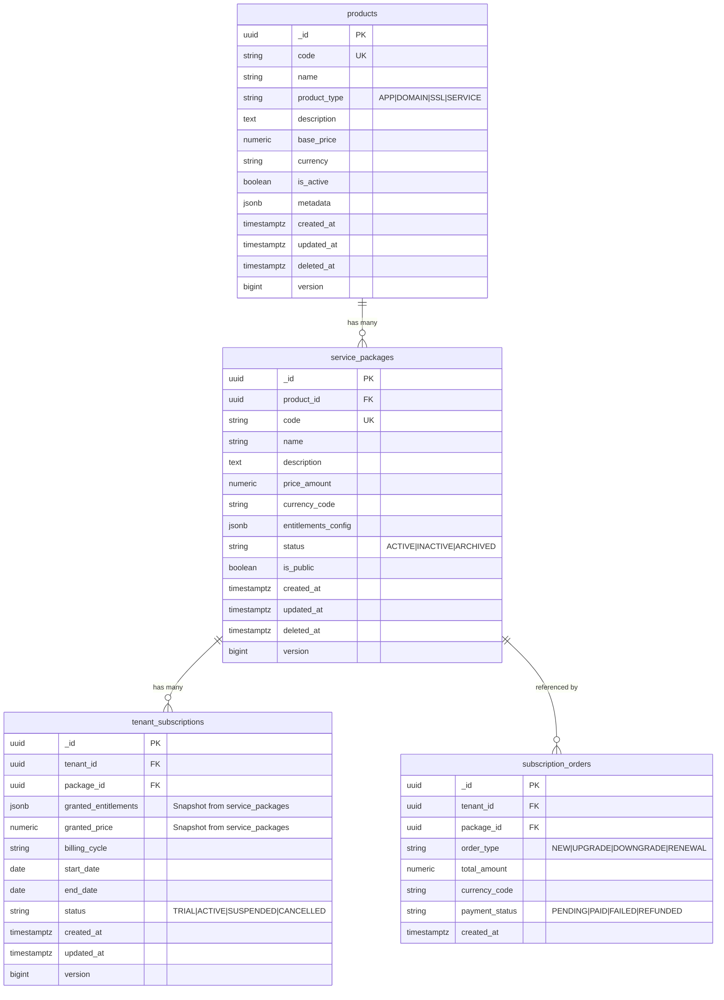
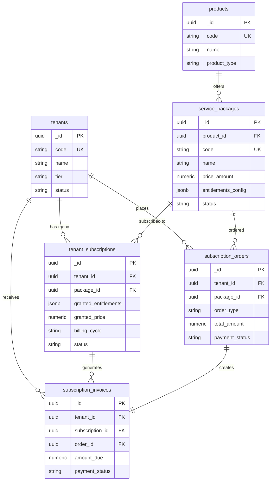

# Service Packages - ERD Diagram

## Entity Relationship Diagram



---

## Detailed Relationships

### 1. Products → Service Packages (One-to-Many)

**Relationship Type**: One-to-Many  
**Cardinality**: 1:N  
**Foreign Key**: `service_packages.product_id` → `products._id`

```sql
ALTER TABLE service_packages
ADD CONSTRAINT fk_package_product
FOREIGN KEY (product_id) REFERENCES products(_id);
```

**Description**:
- Một sản phẩm (product) có thể có nhiều gói dịch vụ (service packages)
- Ví dụ: Sản phẩm "HRM Suite" có thể có các gói "Starter", "Pro", "Enterprise"
- Mỗi gói dịch vụ thuộc về duy nhất một sản phẩm

**Business Rules**:
- Product phải tồn tại trước khi tạo Service Package
- Không thể xóa Product nếu còn Service Package đang ACTIVE
- Khi Product bị soft delete, các Package liên quan nên được archive

---

### 2. Service Packages → Tenant Subscriptions (One-to-Many)

**Relationship Type**: One-to-Many  
**Cardinality**: 1:N  
**Foreign Key**: `tenant_subscriptions.package_id` → `service_packages._id`

```sql
ALTER TABLE tenant_subscriptions
ADD CONSTRAINT fk_subscription_package
FOREIGN KEY (package_id) REFERENCES service_packages(_id);
```

**Description**:
- Một gói dịch vụ có thể được nhiều tenant đăng ký
- Mỗi tenant subscription tham chiếu đến một package cụ thể
- **Snapshot Mechanism**: Khi tenant đăng ký, thông tin package được copy vào `granted_entitlements`

**Business Rules**:
- Package ID được lưu để tham chiếu gốc
- `granted_entitlements` lưu snapshot của `entitlements_config` tại thời điểm đăng ký
- `granted_price` lưu snapshot của `price_amount` để đảm bảo giá không thay đổi
- Tenant subscription không bị ảnh hưởng khi package gốc thay đổi giá/config

**Snapshot Example**:
```sql
-- Khi tenant đăng ký package
INSERT INTO tenant_subscriptions (
    _id, tenant_id, package_id,
    granted_entitlements, granted_price,
    billing_cycle, start_date, end_date
)
SELECT
    gen_random_uuid(),
    'tenant-id-here',
    sp._id,
    sp.entitlements_config,  -- Snapshot config
    sp.price_amount,          -- Snapshot price
    'MONTHLY',
    NOW(),
    NOW() + INTERVAL '1 month'
FROM service_packages sp
WHERE sp._id = 'package-id-here';
```

---

### 3. Service Packages → Subscription Orders (One-to-Many)

**Relationship Type**: One-to-Many  
**Cardinality**: 1:N  
**Foreign Key**: `subscription_orders.package_id` → `service_packages._id`

```sql
ALTER TABLE subscription_orders
ADD CONSTRAINT fk_order_package
FOREIGN KEY (package_id) REFERENCES service_packages(_id);
```

**Description**:
- Một package có thể được đặt mua nhiều lần bởi nhiều tenant
- Mỗi order ghi lại một giao dịch mua/gia hạn/nâng cấp cụ thể

**Business Rules**:
- Order lưu giá tại thời điểm đặt hàng (`total_amount`)
- Package ID giúp tracking package nào được bán nhiều nhất
- Order types: NEW (đăng ký mới), UPGRADE (nâng cấp), DOWNGRADE (hạ cấp), RENEWAL (gia hạn)

---

## Composite Diagram - Full Billing Flow



---

## Data Flow Diagrams

### Flow 1: Package Creation

```
┌─────────────┐
│   Admin     │
└──────┬──────┘
       │ 1. Create Product
       ▼
┌─────────────────┐
│    products     │
│                 │
│  - HRM Suite    │
│  - CRM Suite    │
└──────┬──────────┘
       │ 2. Create Packages for Product
       ▼
┌──────────────────────┐
│  service_packages    │
│                      │
│  - HRM Starter       │
│  - HRM Pro           │
│  - HRM Enterprise    │
└──────────────────────┘
```

### Flow 2: Customer Subscription

```
┌─────────────┐
│   Tenant    │
└──────┬──────┘
       │ 1. Choose Package
       ▼
┌──────────────────────┐
│  service_packages    │
│  "HRM Pro Monthly"   │
│  Price: 999,000 VND  │
│  Config: {...}       │
└──────┬───────────────┘
       │ 2. Create Order
       ▼
┌──────────────────────┐
│ subscription_orders  │
│  Order Type: NEW     │
│  Amount: 999,000     │
│  Status: PENDING     │
└──────┬───────────────┘
       │ 3. Payment Success
       ▼
┌──────────────────────────┐
│  tenant_subscriptions    │
│  Package: HRM Pro        │
│  Granted Config: {...}   │ ← Snapshot
│  Granted Price: 999,000  │ ← Snapshot
│  Status: ACTIVE          │
└──────────────────────────┘
```

### Flow 3: Package Update (Snapshot Protection)

```
Admin Updates Package Price: 999,000 → 1,200,000

┌──────────────────────┐
│  service_packages    │
│  Price: 1,200,000    │ ← New price
│  Updated: Today      │
└──────┬───────────────┘
       │
       │ ❌ Does NOT affect existing subscriptions
       │
       ▼
┌──────────────────────────┐
│  tenant_subscriptions    │
│  Granted Price: 999,000  │ ← OLD price preserved
│  Status: ACTIVE          │
└──────────────────────────┘

       │
       │ ✅ Only affects NEW orders
       │
       ▼
┌──────────────────────┐
│ subscription_orders  │
│  (New Order)         │
│  Amount: 1,200,000   │ ← NEW price
└──────────────────────┘
```

---

## Index Strategy Visualization

```
service_packages Table
├── Primary Key: _id (UUID)
├── Unique Index: code (WHERE deleted_at IS NULL)
├── Foreign Key Index: product_id → products(_id)
│   └── Use Case: "Get all packages of Product X"
├── GIN Index: entitlements_config (JSONB)
│   └── Use Case: "Find packages containing App Y"
├── Composite Index: (status, is_public)
│   └── Use Case: "List active public packages"
└── Partial Index: deleted_at IS NULL
    └── Use Case: "Exclude soft-deleted packages"
```

---

## Query Patterns

### Pattern 1: List Active Public Packages for Product

```sql
-- Uses: idx_packages_product + idx_packages_active_public
SELECT _id, code, name, price_amount, entitlements_config
FROM service_packages
WHERE product_id = 'product-uuid-here'
  AND status = 'ACTIVE'
  AND is_public = TRUE
  AND deleted_at IS NULL
ORDER BY price_amount ASC;
```

### Pattern 2: Find Packages Containing Specific App

```sql
-- Uses: GIN index on entitlements_config
SELECT _id, code, name
FROM service_packages
WHERE entitlements_config @> '{"apps": [{"app_code": "HRM_APP"}]}'
  AND deleted_at IS NULL;
```

### Pattern 3: Get Package with Subscriptions Count

```sql
-- Join with tenant_subscriptions
SELECT 
    sp._id,
    sp.code,
    sp.name,
    sp.price_amount,
    COUNT(ts._id) as subscription_count,
    COUNT(CASE WHEN ts.status = 'ACTIVE' THEN 1 END) as active_subscriptions
FROM service_packages sp
LEFT JOIN tenant_subscriptions ts ON sp._id = ts.package_id
WHERE sp.deleted_at IS NULL
GROUP BY sp._id, sp.code, sp.name, sp.price_amount
ORDER BY subscription_count DESC;
```

### Pattern 4: Revenue Report by Package

```sql
-- Join with subscription_orders
SELECT 
    sp.code,
    sp.name,
    COUNT(so._id) as total_orders,
    SUM(so.total_amount) as total_revenue,
    AVG(so.total_amount) as average_order_value
FROM service_packages sp
INNER JOIN subscription_orders so ON sp._id = so.package_id
WHERE so.payment_status = 'PAID'
  AND so.created_at >= NOW() - INTERVAL '30 days'
GROUP BY sp._id, sp.code, sp.name
ORDER BY total_revenue DESC;
```

---

## Normalization Level

### Current: 3NF (Third Normal Form)

**Reasons**:
1. **No Transitive Dependencies**: All non-key attributes depend only on primary key
2. **Separate Concerns**: Products and Packages are separated properly
3. **Snapshot Pattern**: Denormalization in `tenant_subscriptions` is intentional for business rules

### Intentional Denormalization

**Where**: `tenant_subscriptions.granted_entitlements` and `granted_price`

**Why**:
- Preserve customer contract terms
- Prevent retroactive pricing changes
- Audit trail for what was actually sold
- Performance: No need to JOIN with service_packages for billing

**Trade-off**: Storage space vs Data integrity and Performance

---

## Referential Integrity

### ON DELETE Behavior

```sql
-- Product deleted → Cascade would delete packages (NOT RECOMMENDED)
-- Instead: Use soft delete on both tables
ALTER TABLE service_packages
ADD CONSTRAINT fk_package_product
FOREIGN KEY (product_id) REFERENCES products(_id)
ON DELETE RESTRICT;  -- Prevent deletion if packages exist

-- Package deleted → Subscription should NOT be affected
ALTER TABLE tenant_subscriptions
ADD CONSTRAINT fk_subscription_package
FOREIGN KEY (package_id) REFERENCES service_packages(_id)
ON DELETE RESTRICT;  -- Prevent deletion if active subscriptions exist
```

### Soft Delete Strategy

```sql
-- Instead of hard delete
DELETE FROM service_packages WHERE _id = 'xyz';  -- ❌ DON'T

-- Use soft delete
UPDATE service_packages 
SET deleted_at = NOW(), status = 'ARCHIVED' 
WHERE _id = 'xyz';  -- ✅ DO THIS
```

---

## Change Data Capture (CDC)

For audit and sync purposes:

```sql
-- Trigger for auditing package changes
CREATE OR REPLACE FUNCTION audit_package_changes()
RETURNS TRIGGER AS $$
BEGIN
    INSERT INTO audit_logs (
        table_name, record_id, action, 
        old_data, new_data, changed_by, changed_at
    ) VALUES (
        'service_packages',
        NEW._id,
        TG_OP,
        row_to_json(OLD),
        row_to_json(NEW),
        current_user,
        NOW()
    );
    RETURN NEW;
END;
$$ LANGUAGE plpgsql;

CREATE TRIGGER trg_audit_service_packages
AFTER INSERT OR UPDATE OR DELETE ON service_packages
FOR EACH ROW EXECUTE FUNCTION audit_package_changes();
```

---

## Performance Considerations

### Estimated Table Sizes

```
Assumptions:
- 100 products
- 500 service packages (avg 5 packages per product)
- 10,000 tenant subscriptions
- 50,000 orders (historical)

Storage:
- service_packages: ~500 rows × 2KB = 1 MB
- Indexes: ~3 MB
- Total: ~4 MB (very small, fully cacheable)
```

### Query Performance

| Query Type | Index Used | Est. Time |
|------------|-----------|-----------|
| List all active packages | idx_packages_active_public | < 1ms |
| Find packages by product | idx_packages_product | < 1ms |
| Find packages with app X | idx_packages_entitlements (GIN) | < 5ms |
| Package with subscription count | Multiple + JOIN | < 10ms |

---

## Migration Path

### From Legacy Schema

```sql
-- Step 1: Create new table
-- (Already done with DDL above)

-- Step 2: Migrate data
INSERT INTO service_packages (
    _id, product_id, code, name, description,
    price_amount, currency_code, entitlements_config,
    status, is_public, created_at, updated_at, version
)
SELECT 
    _id,
    product_id,
    package_code,
    package_name,
    description,
    price,
    currency,
    jsonb_build_object(
        'apps', COALESCE(features, '[]'::jsonb),
        'global_limits', COALESCE(limits, '{}'::jsonb)
    ),
    CASE WHEN is_active THEN 'ACTIVE' ELSE 'INACTIVE' END,
    COALESCE(is_public, true),
    created_at,
    updated_at,
    COALESCE(version, 1)
FROM legacy_packages
WHERE deleted_at IS NULL;

-- Step 3: Update foreign keys in dependent tables
UPDATE tenant_subscriptions ts
SET package_id = sp._id
FROM legacy_packages lp
JOIN service_packages sp ON lp._id = sp._id
WHERE ts.package_id = lp._id;

-- Step 4: Verify data integrity
SELECT 
    COUNT(*) as migrated_count,
    COUNT(CASE WHEN deleted_at IS NULL THEN 1 END) as active_count
FROM service_packages;

-- Step 5: Drop legacy table (after backup!)
-- DROP TABLE legacy_packages;
```

---

## Diagram Legend

```
Symbols:
├── ||--o{ : One-to-Many
├── ||--|| : One-to-One
├── }o--o{ : Many-to-Many
├── PK : Primary Key
├── FK : Foreign Key
├── UK : Unique Key
```

---

## Related Diagrams

- [Products ERD](/docs/developer/products-erd-diagram.md)
- [Subscriptions ERD](/docs/developer/subscriptions-erd-diagram.md)
- [Complete Billing System ERD](/docs/ERD_COMPLETE_BILLING.md)
