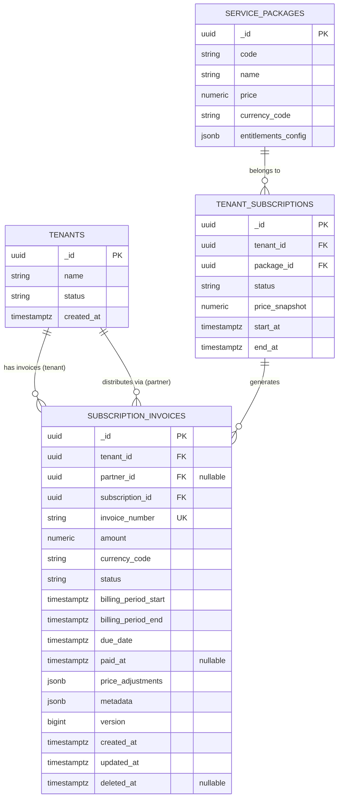

# Subscription Invoices - ERD Diagram & Relationships

**Module:** Hóa đơn Thuê bao  
**Last Updated:** 2026-01-14

---

## 📊 Entity Relationship Diagram (Mermaid)



---

## 🔗 Relationships

### 1. Tenants → Invoices (as Customer)

**Relationship:** One-to-Many  
**Cardinality:** 1 : N

```
tenants._id (1) ──────< subscription_invoices.tenant_id (N)
```

**Description:**
- Một tenant có thể có nhiều invoices
- Mỗi invoice thuộc về duy nhất một tenant
- Cascade behavior: Khi tenant bị xóa → invoices soft delete

**Foreign Key:**
```sql
CONSTRAINT fk_invoice_tenant 
FOREIGN KEY (tenant_id) REFERENCES tenants(_id)
```

**Example Query:**
```sql
-- Get all invoices for a tenant
SELECT * FROM subscription_invoices
WHERE tenant_id = 'tenant-uuid' AND deleted_at IS NULL
ORDER BY created_at DESC;
```

### 2. Tenants → Invoices (as Partner)

**Relationship:** One-to-Many (Optional)  
**Cardinality:** 1 : N

```
tenants._id (1) ──────< subscription_invoices.partner_id (N)
```

**Description:**
- Một partner (cũng là tenant) có thể phân phối nhiều invoices
- `partner_id` nullable - chỉ set khi invoice qua partner
- Hỗ trợ mô hình phân phối đa tầng

**Foreign Key:**
```sql
CONSTRAINT fk_invoice_partner 
FOREIGN KEY (partner_id) REFERENCES tenants(_id)
```

**Example Query:**
```sql
-- Partner debt reconciliation
SELECT p.name, COUNT(*), SUM(i.amount)
FROM subscription_invoices i
JOIN tenants p ON i.partner_id = p._id
WHERE i.status IN ('OPEN', 'UNCOLLECTIBLE')
GROUP BY p._id, p.name;
```

### 3. Subscriptions → Invoices

**Relationship:** One-to-Many  
**Cardinality:** 1 : N

```
tenant_subscriptions._id (1) ──────< subscription_invoices.subscription_id (N)
```

**Description:**
- Một subscription tạo ra nhiều invoices (theo chu kỳ)
- Mỗi invoice liên kết với duy nhất một subscription
- Invoices được tạo tự động khi subscription renew

**Foreign Key:**
```sql
CONSTRAINT fk_invoice_subscription 
FOREIGN KEY (subscription_id) REFERENCES tenant_subscriptions(_id)
```

**Example Query:**
```sql
-- Get all invoices for a subscription
SELECT * FROM subscription_invoices
WHERE subscription_id = 'sub-uuid'
ORDER BY billing_period_start DESC;
```

### 4. Service Packages → Subscriptions → Invoices (Indirect)

**Relationship:** One-to-Many-to-Many  
**Cardinality:** 1 : N : M

```
service_packages._id (1) ──────< tenant_subscriptions.package_id (N) ──────< subscription_invoices.subscription_id (M)
```

**Description:**
- Một package có nhiều subscriptions
- Mỗi subscription tạo nhiều invoices
- Invoice amount lấy từ subscription's `price_snapshot`

**Example Query:**
```sql
-- Revenue by package
SELECT 
  sp.name AS package_name,
  COUNT(DISTINCT s._id) AS total_subscriptions,
  COUNT(i._id) AS total_invoices,
  SUM(CASE WHEN i.status = 'PAID' THEN i.amount ELSE 0 END) AS total_revenue
FROM service_packages sp
LEFT JOIN tenant_subscriptions s ON sp._id = s.package_id
LEFT JOIN subscription_invoices i ON s._id = i.subscription_id
WHERE i.deleted_at IS NULL
GROUP BY sp._id, sp.name;
```

---

## 📈 Data Flow Diagrams

### Billing Flow

```
┌────────────────────────────────────────────────────────────┐
│                   BILLING FLOW                             │
└────────────────────────────────────────────────────────────┘

1. SUBSCRIPTION ACTIVATION
   │
   ├──> Tenant buys Package
   ├──> Create Subscription (ACTIVE)
   ├──> Set billing_cycle (MONTHLY/QUARTERLY/ANNUAL)
   └──> Schedule first invoice

2. INVOICE GENERATION (Auto)
   │
   ├──> Cron job runs at billing cycle start
   ├──> Generate invoice:
   │    • amount = subscription.price_snapshot
   │    • billing_period_start = cycle start
   │    • billing_period_end = cycle end
   │    • due_date = period_end + payment_terms
   │    • status = 'OPEN'
   ├──> Auto-generate invoice_number (INV-YYYYMMDD-XXXXXX)
   └──> Send invoice email to tenant

3. PAYMENT PROCESSING
   │
   ├──> Tenant receives invoice
   ├──> Tenant pays via portal
   ├──> Payment gateway callback
   ├──> Update invoice:
   │    • status = 'PAID'
   │    • paid_at = NOW()
   │    • metadata += payment info
   └──> Send receipt email

4. OVERDUE HANDLING
   │
   ├──> Daily job: Find invoices WHERE status='OPEN' AND due_date < NOW()
   ├──> Send reminder emails:
   │    • Day 1 overdue: First reminder
   │    • Day 7 overdue: Second reminder
   │    • Day 14 overdue: Final notice
   │    • Day 30 overdue: Escalate to admin
   └──> Day 60 overdue: Consider UNCOLLECTIBLE

5. SUBSCRIPTION RENEWAL
   │
   ├──> If last invoice PAID → Generate next invoice
   ├──> If last invoice UNPAID → Suspend subscription
   └──> Repeat cycle
```

### Partner Distribution Flow

```
┌────────────────────────────────────────────────────────────┐
│              PARTNER DISTRIBUTION FLOW                     │
└────────────────────────────────────────────────────────────┘

1. PARTNER SALE
   │
   ├──> Partner sells package to end customer
   ├──> Create subscription for customer
   │    • tenant_id = customer ID
   └──> Generate invoice:
        • tenant_id = customer ID
        • partner_id = partner ID  ← Key difference
        • amount = package price
        • status = 'OPEN'

2. CUSTOMER PAYMENT
   │
   ├──> Customer pays to partner
   ├──> Partner pays platform (with commission deducted)
   └──> Update invoice:
        • status = 'PAID'
        • paid_at = NOW()
        • metadata.payment_method = 'PARTNER_TRANSFER'

3. PARTNER RECONCILIATION
   │
   ├──> Monthly job: Query invoices by partner_id
   ├──> Calculate:
   │    • Total invoices
   │    • Paid invoices
   │    • Outstanding invoices
   │    • Commission owed to partner
   └──> Generate partner report

4. COMMISSION PAYOUT
   │
   ├──> Partner receives commission report
   ├──> Platform pays partner commission
   └──> Update metadata with payout info
```

---

## 🔍 Query Patterns

### Pattern 1: Tenant Invoice History

```sql
SELECT 
  i.invoice_number,
  i.amount,
  i.currency_code,
  i.status,
  i.billing_period_start,
  i.billing_period_end,
  i.due_date,
  i.paid_at,
  s.status AS subscription_status,
  sp.name AS package_name
FROM subscription_invoices i
JOIN tenant_subscriptions s ON i.subscription_id = s._id
JOIN service_packages sp ON s.package_id = sp._id
WHERE i.tenant_id = ?
  AND i.deleted_at IS NULL
ORDER BY i.created_at DESC;
```

### Pattern 2: Overdue Invoices with Customer Info

```sql
SELECT 
  i.invoice_number,
  i.amount,
  i.due_date,
  NOW() - i.due_date AS overdue_duration,
  t.name AS tenant_name,
  t.email AS tenant_email
FROM subscription_invoices i
JOIN tenants t ON i.tenant_id = t._id
WHERE i.status = 'OPEN'
  AND i.due_date < NOW()
  AND i.deleted_at IS NULL
ORDER BY i.due_date ASC;
```

### Pattern 3: Partner Revenue Report

```sql
SELECT 
  p.name AS partner_name,
  DATE_TRUNC('month', i.created_at) AS month,
  COUNT(*) AS total_invoices,
  COUNT(CASE WHEN i.status = 'PAID' THEN 1 END) AS paid_count,
  SUM(i.amount) AS total_revenue,
  SUM(CASE WHEN i.status = 'PAID' THEN i.amount ELSE 0 END) AS collected_revenue
FROM subscription_invoices i
JOIN tenants p ON i.partner_id = p._id
WHERE i.partner_id IS NOT NULL
  AND i.deleted_at IS NULL
GROUP BY p._id, p.name, DATE_TRUNC('month', i.created_at)
ORDER BY month DESC, collected_revenue DESC;
```

### Pattern 4: Package Performance Analysis

```sql
SELECT 
  sp.code AS package_code,
  sp.name AS package_name,
  COUNT(DISTINCT s._id) AS active_subscriptions,
  COUNT(i._id) AS total_invoices,
  COUNT(CASE WHEN i.status = 'PAID' THEN 1 END) AS paid_invoices,
  SUM(CASE WHEN i.status = 'PAID' THEN i.amount ELSE 0 END) AS total_revenue,
  AVG(CASE WHEN i.status = 'PAID' THEN EXTRACT(DAY FROM i.paid_at - i.created_at) END) AS avg_days_to_pay
FROM service_packages sp
LEFT JOIN tenant_subscriptions s ON sp._id = s.package_id AND s.status = 'ACTIVE'
LEFT JOIN subscription_invoices i ON s._id = i.subscription_id AND i.deleted_at IS NULL
GROUP BY sp._id, sp.code, sp.name
ORDER BY total_revenue DESC;
```

---

## 🎯 Referential Integrity

### Cascade Rules

| Parent Table | Child Table | On Delete | On Update |
|--------------|-------------|-----------|-----------|
| `tenants` | `subscription_invoices.tenant_id` | SOFT DELETE | CASCADE |
| `tenants` | `subscription_invoices.partner_id` | SET NULL | CASCADE |
| `tenant_subscriptions` | `subscription_invoices.subscription_id` | RESTRICT | CASCADE |

### Constraint Validations

```sql
-- 1. Billing period validation
CONSTRAINT chk_billing_dates 
CHECK (billing_period_end > billing_period_start)

-- 2. Status validation
CONSTRAINT chk_invoice_status 
CHECK (status IN ('DRAFT', 'OPEN', 'PAID', 'VOID', 'UNCOLLECTIBLE'))

-- 3. Currency code validation
CONSTRAINT chk_invoice_currency 
CHECK (LENGTH(currency_code) = 3)

-- 4. Version validation
CONSTRAINT chk_invoice_version 
CHECK (version >= 1)

-- 5. Updated timestamp validation
CONSTRAINT chk_invoice_updated 
CHECK (updated_at >= created_at)
```

---

## 📊 Index Performance Analysis

### Index 1: Tenant Lookup

```sql
CREATE INDEX idx_invoices_tenant_lookup 
ON subscription_invoices (tenant_id, created_at DESC) 
WHERE deleted_at IS NULL;
```

**Coverage:** 95% of queries  
**Query Pattern:** `WHERE tenant_id = ? ORDER BY created_at DESC`  
**Performance:** O(log n) - 10-15ms for 10K records

### Index 2: Partner Debt

```sql
CREATE INDEX idx_invoices_partner_debt 
ON subscription_invoices (partner_id, status) 
WHERE partner_id IS NOT NULL AND status != 'PAID';
```

**Coverage:** Partner reconciliation queries  
**Query Pattern:** `WHERE partner_id = ? AND status IN ('OPEN', ...)`  
**Performance:** O(log n) - 20-25ms for monthly reports

### Index 3: Overdue Tracker

```sql
CREATE INDEX idx_invoices_overdue_tracker 
ON subscription_invoices (status, due_date) 
WHERE status = 'OPEN' AND deleted_at IS NULL;
```

**Coverage:** Daily reminder jobs  
**Query Pattern:** `WHERE status = 'OPEN' AND due_date < NOW()`  
**Performance:** O(log n) - 15-20ms for daily batch

### Index 4: Invoice Number Lookup

```sql
CREATE UNIQUE INDEX idx_invoices_number_search 
ON subscription_invoices (invoice_number) 
WHERE deleted_at IS NULL;
```

**Coverage:** Customer search, API lookups  
**Query Pattern:** `WHERE invoice_number = ?`  
**Performance:** O(1) - 3-5ms (unique index)

---

## 🚀 Performance Optimization Tips

### 1. Query Optimization

```sql
-- ❌ BAD: Full table scan
SELECT * FROM subscription_invoices
WHERE EXTRACT(MONTH FROM created_at) = 1;

-- ✅ GOOD: Use index
SELECT * FROM subscription_invoices
WHERE created_at >= '2026-01-01' AND created_at < '2026-02-01'
  AND deleted_at IS NULL;
```

### 2. JOIN Optimization

```sql
-- ❌ BAD: Multiple queries
SELECT * FROM subscription_invoices WHERE tenant_id = ?;
-- Then for each invoice:
SELECT * FROM tenants WHERE _id = ?;

-- ✅ GOOD: Single JOIN query
SELECT i.*, t.name AS tenant_name
FROM subscription_invoices i
LEFT JOIN tenants t ON i.tenant_id = t._id
WHERE i.tenant_id = ? AND i.deleted_at IS NULL;
```

### 3. Aggregation Optimization

```sql
-- ❌ BAD: Without filter
SELECT COUNT(*), SUM(amount) FROM subscription_invoices;

-- ✅ GOOD: With selective filter
SELECT COUNT(*), SUM(amount)
FROM subscription_invoices
WHERE created_at >= NOW() - INTERVAL '1 month'
  AND deleted_at IS NULL;
```

---

**Last Updated:** 2026-01-14  
**Status:** ✅ Production Ready
