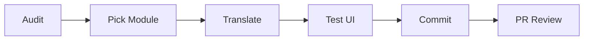

# HƯỚNG DẪN NHANH - VIETNAMESE TRANSLATION
> **Dành cho**: Translators & Developers  
> **Thời gian đọc**: 5 phút  
> **Mục tiêu**: Bắt đầu dịch ngay trong 10 phút

---

## 🚀 BẮT ĐẦU NHANH (10 phút)

### Bước 1: Hiểu Cấu Trúc (2 phút)

```
/i18n/
├── vi.ts          ← FILE CHÍNH cần edit
├── en.ts          ← Reference (không edit)
├── config.ts      ← Cấu hình i18n
└── ...
```

**File chính cần làm việc**: `/i18n/vi.ts`

### Bước 2: Chạy Audit (3 phút)

```bash
# Kiểm tra xem còn thiếu keys nào
cd /path/to/project
ts-node scripts/audit-vietnamese-translation.ts

# Xem report
cat docs/i18n/translation-audit-report.md
```

**Output**: Danh sách keys cần dịch theo priority

### Bước 3: Dịch Batch Đầu Tiên (5 phút)

Mở file `/i18n/vi.ts`, tìm section navigation và bắt đầu dịch:

```typescript
// BEFORE
navigation: {
  dashboard: 'Dashboard',    // 🔴 Chưa dịch
  products: 'Products',      // 🔴 Chưa dịch
}

// AFTER
navigation: {
  dashboard: 'Bảng điều khiển',  // ✅ Đã dịch
  products: 'Sản phẩm',          // ✅ Đã dịch
}
```

**Quy tắc vàng**: 
- ✅ Dịch clear, ngắn gọn
- ✅ Check [Terminology Glossary](/docs/i18n/TERMINOLOGY_GLOSSARY.md)
- ✅ Giữ format `{variable}` nguyên
- ❌ KHÔNG dịch technical terms (API, URL, JSON...)

---

## 📚 TÀI LIỆU CHÍNH

### 1. Kế Hoạch Tổng Thể
📄 [VIETNAMESE_TRANSLATION_PLAN.md](/docs/i18n/VIETNAMESE_TRANSLATION_PLAN.md)
- Timeline 3 tuần
- 5 Phases chi tiết
- Checklist đầy đủ

### 2. Bảng Thuật Ngữ
📄 [TERMINOLOGY_GLOSSARY.md](/docs/i18n/TERMINOLOGY_GLOSSARY.md)
- 500+ thuật ngữ chuẩn
- Examples & best practices
- Tone & style guide

### 3. Audit Report
📄 `/docs/i18n/translation-audit-report.md` (auto-generated)
- Keys còn thiếu
- Completion rate
- Priority breakdown

---

## 🎯 WORKFLOW CHUẨN

### Developer Workflow



### Chi Tiết Từng Bước

#### 1. 🔍 Audit (Ngày đầu tiên)
```bash
# Chạy audit script
ts-node scripts/audit-vietnamese-translation.ts

# Review report
code docs/i18n/translation-audit-report.md

# Chọn module ưu tiên
# - Critical: navigation, menu, auth
# - High: errors, validation, forms
# - Medium: descriptions, labels
# - Low: docs, technical
```

#### 2. 📦 Pick Module
```typescript
// Example: Bắt đầu với module "products"

// Tìm trong /i18n/vi.ts
products: {
  title: 'Products',              // ← Cần dịch
  subtitle: 'Manage products',    // ← Cần dịch
  addProduct: 'Add Product',      // ← Cần dịch
  // ... 50 more keys
}
```

#### 3. ✍️ Translate
```typescript
// Check terminology first!
// products = "Sản phẩm" (from glossary)

products: {
  title: 'Sản phẩm',
  subtitle: 'Quản lý sản phẩm',
  addProduct: 'Thêm sản phẩm',
  editProduct: 'Sửa sản phẩm',
  deleteProduct: 'Xóa sản phẩm',
  productDetails: 'Chi tiết sản phẩm',
  
  // Validation messages
  errors: {
    nameRequired: 'Vui lòng nhập tên sản phẩm',
    priceInvalid: 'Giá sản phẩm không hợp lệ',
  },
  
  // Success messages
  messages: {
    createSuccess: 'Tạo sản phẩm thành công',
    updateSuccess: 'Cập nhật sản phẩm thành công',
    deleteSuccess: 'Xóa sản phẩm thành công',
  }
}
```

#### 4. 🧪 Test UI
```bash
# Start dev server
npm run dev

# Navigate to the translated page
# Example: http://localhost:3000/products

# Visual checks:
# ✅ Text hiển thị đúng
# ✅ Không bị cắt chữ
# ✅ Ký tự đặc biệt (ă, ê, ơ, ư, đ) hiển thị OK
# ✅ Button text rõ ràng
# ✅ Error messages hợp lý
```

#### 5. 💾 Commit
```bash
git add i18n/vi.ts
git commit -m "feat(i18n): Translate products module to Vietnamese

- Add Vietnamese translations for products module
- Includes: titles, forms, validations, messages
- Ref: VIETNAMESE_TRANSLATION_PLAN.md Phase 2 Batch 2.3"

git push origin feature/i18n-products
```

#### 6. 👀 PR Review
**Self-review checklist:**
- [ ] Thuật ngữ nhất quán với glossary
- [ ] Không có typos
- [ ] Grammar chính xác
- [ ] Đã test trên UI
- [ ] Format `{variable}` giữ nguyên
- [ ] Technical terms không dịch

**Peer review:**
- Native speaker check
- Context appropriateness
- Tone & style

---

## 📖 EXAMPLES THỰC TẾ

### Example 1: Navigation Menu

```typescript
// EN
navigation: {
  dashboard: 'Dashboard',
  products: 'Products',
  orders: 'Orders',
  settings: 'Settings',
}

// VI - Option 1: Keep some English terms
navigation: {
  dashboard: 'Dashboard',           // Technical UI, giữ nguyên
  products: 'Sản phẩm',
  orders: 'Đơn hàng',
  settings: 'Cài đặt',
}

// VI - Option 2: Full Vietnamese (RECOMMENDED)
navigation: {
  dashboard: 'Bảng điều khiển',
  products: 'Sản phẩm',
  orders: 'Đơn hàng',
  settings: 'Cài đặt',
}
```

### Example 2: Form Validation

```typescript
// EN
validation: {
  required: 'Please enter {{field}}',
  minLength: '{{field}} must be at least {{min}} characters',
  email: 'Invalid email',
}

// VI
validation: {
  required: 'Vui lòng nhập {{field}}',
  minLength: '{{field}} phải có ít nhất {{min}} ký tự',
  email: 'Email không hợp lệ',
}

// Usage in code (unchanged):
// t('validation.required', { field: 'email' })
// Output: "Vui lòng nhập email"
```

### Example 3: CRUD Actions

```typescript
// EN
products: {
  addProduct: 'Add Product',
  editProduct: 'Edit Product',
  deleteProduct: 'Delete Product',
  confirmDelete: 'Are you sure you want to delete this product?',
  deleteSuccess: 'Product deleted successfully',
  deleteError: 'Failed to delete product',
}

// VI
products: {
  addProduct: 'Thêm sản phẩm',
  editProduct: 'Sửa sản phẩm',
  deleteProduct: 'Xóa sản phẩm',
  confirmDelete: 'Bạn có chắc chắn muốn xóa sản phẩm này?',
  deleteSuccess: 'Xóa sản phẩm thành công',
  deleteError: 'Không thể xóa sản phẩm',
}
```

### Example 4: Complex Nested Structure

```typescript
// EN
tenants: {
  title: 'Tenant Management',
  analytics: {
    totalTenants: 'Total Tenants',
    activeTenants: 'Active Tenants',
    mrr: 'Monthly Recurring Revenue',
  },
  form: {
    basicInfo: 'Basic Information',
    name: 'Tenant Name',
    namePlaceholder: 'Enter tenant name',
    errors: {
      nameRequired: 'Tenant name is required',
    }
  }
}

// VI
tenants: {
  title: 'Quản lý Tenant',
  analytics: {
    totalTenants: 'Tổng số tenant',
    activeTenants: 'Tenant hoạt động',
    mrr: 'Doanh thu hàng tháng',
  },
  form: {
    basicInfo: 'Thông tin cơ bản',
    name: 'Tên tenant',
    namePlaceholder: 'Nhập tên tenant',
    errors: {
      nameRequired: 'Vui lòng nhập tên tenant',
    }
  }
}
```

---

## ⚠️ PITFALLS & SOLUTIONS

### Pitfall 1: Over-translating Technical Terms

```typescript
// ❌ WRONG
api: 'Giao diện lập trình ứng dụng',
json: 'Ký hiệu đối tượng JavaScript',
url: 'Định vị tài nguyên thống nhất',

// ✅ RIGHT
api: 'API',
json: 'JSON',
url: 'URL',
```

### Pitfall 2: Too Formal

```typescript
// ❌ TOO FORMAL
deleteConfirm: 'Quý khách có chắc chắn muốn thực hiện thao tác xóa đối tượng này không?',

// ✅ FRIENDLY & CLEAR
deleteConfirm: 'Bạn có chắc chắn muốn xóa?',
```

### Pitfall 3: Inconsistent Terminology

```typescript
// ❌ INCONSISTENT
users: {
  title: 'Quản lý người dùng',
  addUser: 'Thêm user',           // Mixed!
  deleteUser: 'Xóa người sử dụng', // Different term!
}

// ✅ CONSISTENT
users: {
  title: 'Quản lý người dùng',
  addUser: 'Thêm người dùng',
  deleteUser: 'Xóa người dùng',
}
```

### Pitfall 4: Breaking Interpolation

```typescript
// ❌ WRONG - Breaking {variable}
'Hello {name}' => 'Xin chào tên'  // Lost variable!

// ✅ RIGHT - Keep variable intact
'Hello {name}' => 'Xin chào {name}'
```

### Pitfall 5: Long Text Overflow

```typescript
// ❌ TOO LONG
save: 'Nhấn vào đây để lưu lại những thay đổi của bạn'

// ✅ CONCISE
save: 'Lưu'

// If need more context, use tooltip/helper text instead
```

---

## 🛠️ TOOLS & SCRIPTS

### 1. Audit Script
```bash
# Check missing translations
ts-node scripts/audit-vietnamese-translation.ts

# Output:
# - docs/i18n/translation-audit-report.md
# - docs/i18n/missing-keys.json
```

### 2. Type Check
```bash
# Ensure type safety
npm run type-check

# TypeScript will catch:
# - Missing keys
# - Wrong structure
# - Type mismatches
```

### 3. Dev Server with Language Switcher
```bash
# Start dev server
npm run dev

# Switch language in UI
# Top-right corner → Language → Vietnamese
```

### 4. Find Hardcoded Strings (Future)
```bash
# TODO: Script to find hardcoded Vietnamese strings in code
# grep -r "Vietnamese text" app/ components/
```

---

## 📋 CHECKLISTS

### Daily Checklist
- [ ] Pull latest `main` branch
- [ ] Run audit script
- [ ] Pick module from plan
- [ ] Translate 1-2 modules
- [ ] Test on UI
- [ ] Commit with clear message
- [ ] Create PR

### Weekly Checklist
- [ ] Review progress with team
- [ ] Update completion rate
- [ ] Sync terminology updates
- [ ] Address PR feedback
- [ ] Plan next week's modules

### Before Committing
- [ ] No typos
- [ ] Consistent with glossary
- [ ] Tested on UI
- [ ] Variables intact
- [ ] Context appropriate
- [ ] TypeScript builds without errors

### PR Review Checklist
- [ ] Native speaker review
- [ ] Tone & style appropriate
- [ ] No grammar errors
- [ ] UI screenshots attached
- [ ] All checks passing

---

## 🎓 LEARNING RESOURCES

### Internal
- 📄 [Translation Plan](/docs/i18n/VIETNAMESE_TRANSLATION_PLAN.md)
- 📄 [Terminology Glossary](/docs/i18n/TERMINOLOGY_GLOSSARY.md)
- 📄 Translation Audit Report (auto-generated)

### External
- [react-i18next Docs](https://react.i18next.com/)
- [i18next Docs](https://www.i18next.com/)
- [Microsoft Language Portal](https://www.microsoft.com/en-us/language)
- [Google I18n Guide](https://developers.google.com/international)

### Style Guides
- Friendly, not formal ("bạn" not "quý khách")
- Clear and concise
- Action-oriented verbs
- Consistent terminology

---

## 💬 COMMUNICATION

### Questions?
- **Slack**: #i18n-vietnamese
- **GitHub**: Open issue with `i18n` label
- **Email**: translation-team@company.com

### Weekly Sync
- **When**: Every Monday 10:00 AM
- **Where**: Zoom / Google Meet
- **Agenda**: 
  - Progress review
  - Blockers discussion
  - Next week planning

---

## 🚀 GET STARTED NOW!

```bash
# 1. Audit current status
ts-node scripts/audit-vietnamese-translation.ts

# 2. Open main file
code i18n/vi.ts

# 3. Open glossary as reference
code docs/i18n/TERMINOLOGY_GLOSSARY.md

# 4. Start translating!
# Focus on Critical priority keys first

# 5. Test
npm run dev

# 6. Commit
git add i18n/vi.ts
git commit -m "feat(i18n): Translate [module] to Vietnamese"
git push

# 7. Create PR and request review
```

**You're ready to contribute! 🎉**

---

## 📊 TRACK YOUR PROGRESS

### Personal Tracker (Example)

| Date | Module | Keys Translated | Status | Notes |
|------|--------|----------------|--------|-------|
| 2026-01-20 | products | 45 | ✅ Done | Tested on UI |
| 2026-01-21 | orders | 38 | ⏳ In Progress | Need review |
| 2026-01-22 | invoices | - | 📅 Planned | - |

### Team Progress

Check the main plan for overall progress:
📄 [VIETNAMESE_TRANSLATION_PLAN.md](/docs/i18n/VIETNAMESE_TRANSLATION_PLAN.md#progress-tracking)

---

*Happy translating! 🇻🇳*
